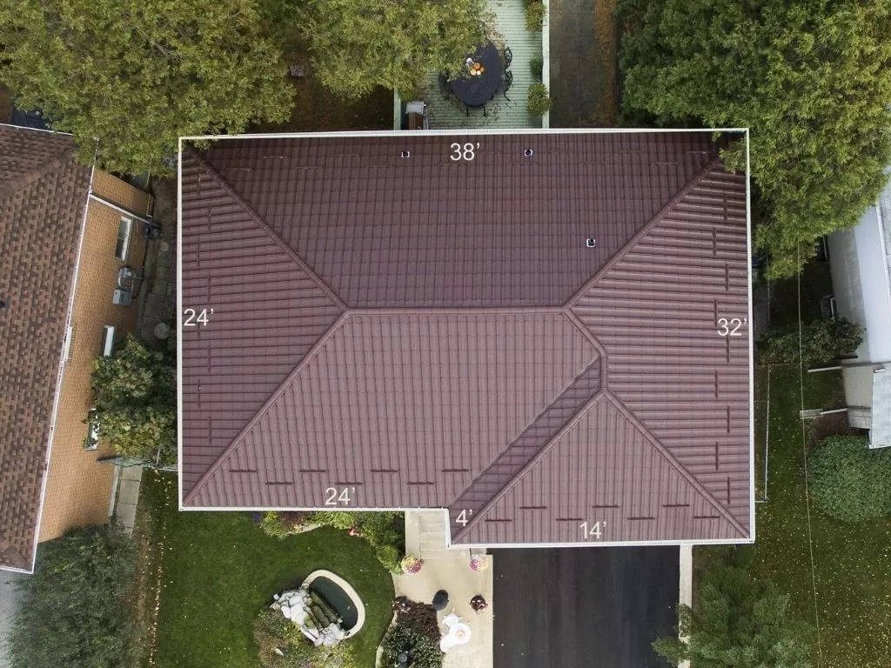
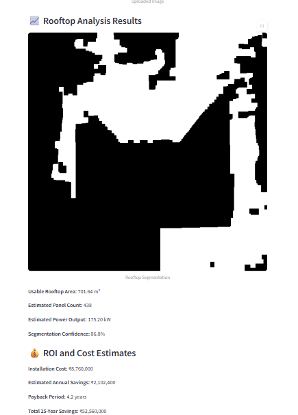

# SolarScope Rooftop Analyzer

SolarScope is a full-stack solar rooftop analysis app that helps users estimate system size, cost, and ROI from multiple inputs: satellite imagery, address lookup, manual area, or an interactive map draw tool. It includes authentication, saved projects, PDF reports, and optional ML-based segmentation for more accurate roof detection.

## Live Website
https://solarscope-ai.onrender.com/

## Demo
To be added soon.

## Features
- Authentication with user dashboards and saved projects
- Multiple analysis modes: image upload, address lookup, manual area, and map draw
- Roof segmentation with confidence scoring (heuristic pipeline by default)
- Hugging Face roof detector model (primary ML step)
- Heuristic roof segmentation refined inside detected roof bounds
- TorchScript segmentation model support (only if configured)
- Optional Hugging Face roof detector to improve bounding box targeting
- ROI estimation with panel layout, cost, and savings assumptions
- PDF report export
- Clean, responsive UI with avatar selection and uploads

## Example Use Case
**Input Image**



**Output Results**



## How It Works (High Level)
1) User selects an analysis mode (image, address, draw, or manual).
2) For images, the app detects the roof with the Hugging Face model `Yifeng-Liu/rt-detr-finetuned-for-satellite-image-roofs-detection`.
3) It refines the roof mask using a heuristic segmentation pass inside the detected bounding box.
4) If detection is unavailable or fails, the app falls back to the heuristic-only segmentation path.
5) Panel layout is computed from usable area and panel sizing assumptions.
6) System size, cost, and ROI are estimated from defaults or user preferences.
7) Results are saved as a project and can be exported as a PDF report.

## Tech Stack
- Backend: FastAPI, SQLAlchemy, SQLite
- Frontend: Jinja templates, vanilla JS, CSS
- Mapping: Leaflet, OpenStreetMap tiles, Leaflet.draw
- Image processing: Pillow
- ML: Hugging Face roof detector (Yifeng-Liu/rt-detr-finetuned-for-satellite-image-roofs-detection)
- Deployment: Render (current live demo)

## Project Structure
- app/: FastAPI app, templates, static assets, auth, and services
- analysis/: segmentation, ROI, panel layout, and estimation logic
- data/: runtime data (SQLite DB, uploads, outputs, reports)
- Dockerfile: container build

## Quick Start (Local)
1) Install dependencies:

```bash
pip install -r requirements.txt
```

2) Run the app:

```bash
uvicorn app.main:app --reload
```

3) Open `http://localhost:8000`.

## Environment Variables
Use these to enable the detector-driven workflow. The pipeline uses the Hugging Face roof detector first, then applies heuristic segmentation inside the detected roof bounds; if detection is unavailable or fails, it falls back to the heuristic-only path.

### TorchScript Segmentation Model (Optional)

```bash
set SOLAR_MODEL_PATH=C:\path\to\model.pt
```

### Hugging Face Roof Detector (Primary)

```bash
set HF_TOKEN=your_huggingface_token
set HF_DETECT_MODEL=Yifeng-Liu/rt-detr-finetuned-for-satellite-image-roofs-detection
```

This detects a roof bounding box, crops the image, then refines the mask inside the box. The detector request resizes large images and retries on transient API failures.

## Docker (Optional)

```bash
docker build -t solarscope .
docker run -p 8000:8000 solarscope
```

## Usage Tips
- Address-based analysis depends on OpenStreetMap coverage. Some locations may be missing footprints.
- For best segmentation results, use high-resolution overhead imagery with clear roof boundaries.
- Draw mode is a great fallback when imagery is low quality.

## License
This project is licensed under the MIT License - see the LICENSE file for details.
